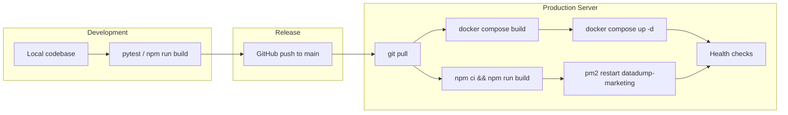

# DataDumpAI Enterprise — System Architecture

This document describes the overall system design: how components interact, where data lives, and how traffic flows from the public internet to application services.

For server-specific deployment details (IPs, SSH, rollback commands), see [PRODUCTION.md](./PRODUCTION.md).

---

## Overview

DataDumpAI Enterprise is a multi-surface product:

| Surface | Technology | Role |
|---------|------------|------|
| **Marketing site** | Next.js 15 (App Router) | Public homepage, SEO, pricing, docs, contact |
| **Application** | Streamlit (Python) | Authenticated workspace — uploads, AI reports, billing |
| **Webhook service** | FastAPI (Python) | Stripe and Paystack subscription events |
| **Platform backend** | Supabase | Auth, PostgreSQL metadata, object storage |

The marketing site and application are **separate deployables** on the same server, fronted by Nginx.

```
┌─────────────────────────────────────────────────────────────────────┐
│                         Public Internet                              │
└───────────────────────────────┬─────────────────────────────────────┘
                                │
                    ┌───────────▼───────────┐
                    │   Nginx (host :443)     │
                    └───────────┬───────────┘
            ┌───────────────────┼───────────────────┐
            │                   │                   │
   www.getdatadump.com    app.getdatadump.com       │
            │                   │                   │
   ┌────────▼────────┐  ┌───────▼────────┐         │
   │  PM2 :3000      │  │ Docker :8501   │         │
   │  Next.js        │  │ Streamlit app  │         │
   │  marketing-site │  │                │         │
   └────────┬────────┘  └───────┬────────┘         │
            │                   │                   │
            │ Launch App        │  ┌────────────────▼──┐
            └──────────────────►│ Docker :8001       │
                                  │ FastAPI webhooks   │
                                  └────────┬───────────┘
                                           │
                              ┌────────────▼────────────┐
                              │      Supabase Cloud      │
                              │  Auth · Postgres · Storage│
                              └─────────────────────────┘
                                           │
                              ┌────────────▼────────────┐
                              │       OpenAI API         │
                              └─────────────────────────┘
```

---

## Streamlit application

**Entry point:** `app.py`  
**Framework:** Streamlit 1.x on Python 3.12

### Responsibilities

- User authentication gate (Supabase Auth)
- Workspace UI — projects, documents, reports, settings
- AI Copilot chat and document search
- Report generation (Executive Summary, Board Report, Financial Analysis, etc.)
- PDF/DOCX/Markdown export
- Billing UI (Stripe/Paystack checkout flows)
- Admin panel and onboarding wizard

### Application layers

```
app.py                          ← Streamlit entry, auth gate, routing
├── core/                       ← Session, auth, navigation, database client
│   ├── auth.py                 ← Supabase session management
│   ├── database.py             ← Supabase PostgreSQL client
│   └── navigation.py           ← Page routing
├── ui/                         ← Streamlit pages and components
│   ├── workspace/              ← Main authenticated workspace
│   ├── auth/                   ← Sign-in, sign-up, password reset
│   └── landing/                ← Public landing page
├── services/                   ← Business logic
│   ├── auth_service.py
│   ├── report_service.py
│   ├── document_processor.py
│   ├── stripe_billing_service.py
│   └── ...
├── repositories/               ← Data access (Supabase or JSON fallback)
│   ├── supabase_project_repository.py
│   └── json_project_repository.py
├── application/                ← Use-case pipelines
│   ├── use_cases/
│   ├── chat_pipeline.py
│   └── search_pipeline.py
├── storage/                    ← Blob storage abstraction
│   └── file_store.py           ← Local filesystem or Supabase Storage
└── config.py                   ← Environment-driven configuration
```

### Request lifecycle

1. `app.py` sets page config, injects SEO metadata, initializes session
2. Auth cookies are checked; unauthenticated users see landing or auth pages
3. Authenticated users enter the workspace shell (`ui/workspace/shell.py`)
4. Services load data through repositories (Supabase PostgreSQL when configured)
5. File uploads and exports go through `FileStore` (Supabase Storage or local `data/`)

### Configuration

Backend behavior is controlled by environment variables in `config.py`:

- `DATABASE_BACKEND=supabase` → metadata in Supabase PostgreSQL
- `STORAGE_BACKEND=supabase` → files in Supabase Storage bucket `datadumpai-files`
- Falls back to local JSON/filesystem when Supabase is not configured (development only)

---

## Next.js marketing site

**Location:** `marketing-site/`  
**Framework:** Next.js 15, TypeScript, Tailwind CSS, App Router

### Responsibilities

- Public product homepage and brand presence
- SEO (metadata API, JSON-LD, sitemap, robots.txt)
- Marketing pages: Features, Solutions, Industries, Pricing, About, Contact
- Documentation hub (placeholder content)
- Legal pages: Privacy, Terms, Security
- "Launch App" CTA → links to Streamlit at `NEXT_PUBLIC_APP_URL`

### Key files

```
marketing-site/
├── src/app/              ← App Router pages
├── src/components/       ← Header, Footer, Hero, forms
├── src/lib/
│   ├── site.ts           ← Site URL and app URL config
│   ├── metadata.ts       ← SEO helpers
│   └── content.ts        ← Static marketing copy
├── public/               ← Optimized images (WebP + PNG fallbacks)
└── .env.example          ← Public env var template
```

### Runtime

- **Development:** `npm run dev` → `localhost:3000`
- **Production:** `npm run build && npm start` under PM2 on port 3000
- Nginx proxies `getdatadump.com` / `www.getdatadump.com` → `:3000`

The marketing site has **no backend API** of its own — it is a static/SSR frontend. Contact form submission is client-side (wire to an email API in production).

---

## FastAPI webhook service

**Entry point:** `api/webhook_server.py`  
**Runtime:** Separate Docker container (same image as Streamlit, different command)

Streamlit cannot reliably receive raw POST bodies from payment providers, so billing webhooks run in a dedicated FastAPI process.

### Endpoints

| Method | Path | Purpose |
|--------|------|---------|
| `GET` | `/health` | Container health check |
| `POST` | `/webhooks/stripe` | Stripe subscription lifecycle events |
| `POST` | `/webhooks/paystack` | Paystack charge events |

### Event handling

- **Stripe:** `checkout.session.completed`, `customer.subscription.updated/deleted`, `invoice.payment_failed`
- **Paystack:** `charge.success` and related subscription events

Events update subscription state via `SubscriptionService` and `billing_repository`, and may trigger email notifications.

Nginx routes `https://app.getdatadump.com/webhooks/*` → container port `8001`.

---

## Storage

DataDumpAI uses a dual-storage model: **metadata in PostgreSQL**, **blobs in object storage**.

### Metadata (Supabase PostgreSQL)

When `DATABASE_BACKEND=supabase`, application records live in Supabase:

| Table | Contents |
|-------|----------|
| `user_profiles` | Name, company, job title |
| `user_usage` | Plan limits, monthly counters |
| `projects` | Workspace projects per user |
| `documents` | Document metadata and storage paths |
| `reports` | Generated report metadata |
| `subscriptions` | Billing state |
| `activity_logs` | Audit trail |
| `login_lockouts` | Failed sign-in tracking |

Schema defined in `supabase/migrations/001` through `008`. Row Level Security (RLS) enforces per-user isolation.

**Fallback:** `DATABASE_BACKEND=json` stores metadata as JSON files under `data/users/{user_id}/` (development and staging only).

### File blobs (Supabase Storage)

When `STORAGE_BACKEND=supabase`, files are stored in the private bucket `datadumpai-files`:

```
{user_id}/{project_id}/{category}/{filename}
```

Categories: `documents`, `reports`, `exports`

Access is controlled by Supabase Storage policies (users can only read/write their own prefix). The server uses `SUPABASE_SERVICE_ROLE_KEY` for privileged operations.

**Fallback:** `STORAGE_BACKEND=local` writes to `data/users/{user_id}/projects/{project_id}/` on disk. In Docker, this maps to the `app_data` volume.

### Local runtime directories

| Path | Purpose | Git tracked |
|------|---------|-------------|
| `data/users/` | Per-user JSON metadata (fallback mode) | `.gitkeep` only |
| `data/uploads/` | Temporary upload staging | `.gitkeep` only |
| `data/reports/` | Generated report cache | `.gitkeep` only |
| `data/cache/` | Application cache | `.gitkeep` only |
| `exports/` | User export downloads | `.gitkeep` only |
| `static/` | SEO assets served by nginx (robots, sitemap, logos) | Yes |

---

## Supabase integration

Supabase is the production platform backend for auth, database, and file storage.

### Authentication

- Email/password sign-up with email confirmation
- Password reset via magic link
- Anonymous sign-ins disabled in production
- `AUTH_REDIRECT_URL` must match the Streamlit domain (`https://app.getdatadump.com`)
- `AUTH_DEV_BYPASS=true` bypasses Supabase for local dev only

**Client-side:** `SUPABASE_URL` + `SUPABASE_ANON_KEY` (safe for frontend)  
**Server-side:** `SUPABASE_SERVICE_ROLE_KEY` (lockout tracking, admin ops, storage uploads)

### Database client

`core/database.py` provides:

- `get_database_client(access_token=...)` — user-scoped queries (respects RLS)
- `get_service_role_client()` — server-side operations

Repositories switch between Supabase and JSON implementations based on `DATABASE_BACKEND`.

### Storage client

`storage/file_store.py` abstracts read/write/delete across backends. Production uses the Supabase Storage SDK with the service role key.

### Migrations

Apply in order via the Supabase SQL editor or CLI:

```
supabase/migrations/
├── 001_initial_schema.sql
├── 002_subscription.sql
├── 003_storage.sql
├── 004_billing.sql
├── 005_notification_preferences.sql
├── 006_admin_roles_audit.sql
├── 007_auth_profile_enhancements.sql
└── 008_platform_features.sql
```

Migration script for legacy JSON data: `scripts/migrate_json_to_supabase.py`

---

## Docker layout

```
/opt/datadumpai-enterprise/
├── Dockerfile              ← Python 3.12-slim, Streamlit + deps
├── docker-compose.yml      ← app + webhooks services
├── .dockerignore
├── .env                    ← production secrets (not in git)
└── (application source)
```

### Services

```yaml
services:
  app:        # Streamlit → :8501
  webhooks:   # uvicorn api.webhook_server:app → :8001

volumes:
  app_data:   # Shared /app/data for local fallback storage
```

Both services build from the same `Dockerfile`. The webhook service overrides the default `CMD` with `uvicorn`.

Health checks are built into both the Dockerfile and compose file. Containers restart automatically unless stopped.

---

## Deployment flow



### Blue/green pattern (used for v1.0 cutover)

1. Deploy new stack on alternate ports (`8501`, `8001`) alongside the old stack (`8080`, `8000`)
2. Verify health endpoints and smoke-test functionality
3. Switch Nginx upstreams and reload
4. Keep old containers running for instant rollback

This pattern is documented in detail in [PRODUCTION.md](./PRODUCTION.md).

---

## Nginx topology

Nginx runs on the host (not in Docker) and terminates TLS for all public domains.

```
                    ┌──────────────────────────────────────┐
                    │         Nginx :443 (TLS)             │
                    │  cert: /etc/letsencrypt/live/        │
                    │        getdatadump.com/              │
                    └──────────────┬───────────────────────┘
                                   │
          ┌────────────────────────┼────────────────────────┐
          │                        │                        │
   server_name:              server_name:              port 80
   getdatadump.com           app.getdatadump.com       → 301 HTTPS
   www.getdatadump.com
          │                        │
   location /                 location /
   → :3000 (PM2)              → :8501 (Docker Streamlit)
                              location /webhooks/
                              → :8001 (Docker FastAPI)
```

### Proxy headers

All upstreams receive:

- `Host`, `X-Forwarded-Host`, `X-Forwarded-Proto`, `X-Forwarded-For`
- `Upgrade` / `Connection` for WebSocket support (Streamlit and Next.js)

Streamlit additionally uses `proxy_read_timeout 86400` for long-running sessions.

### Static assets

SEO files for the Streamlit era are served from `/opt/datadumpai-enterprise/static/` when configured in nginx (`robots.txt`, `sitemap.xml`, `og-image.png`, favicons). The Next.js marketing site serves its own assets from `marketing-site/public/`.

---

## External integrations

| Service | Used by | Purpose |
|---------|---------|---------|
| **OpenAI** | Streamlit services | Report generation, Copilot, embeddings |
| **Supabase** | Auth, DB, Storage | Platform backend |
| **Stripe** | Billing UI + webhooks | Subscriptions (USD) |
| **Paystack** | Billing UI + webhooks | Subscriptions (NGN) |
| **SMTP / Resend** | Email service | Verification, notifications, billing alerts |
| **Google Analytics** | Marketing site | Optional traffic analytics |
| **Sentry** | Marketing site | Optional error monitoring |

---

## Testing

- **Backend:** `pytest` (122+ tests covering auth, billing, reports, storage, pipelines)
- **Marketing site:** `npm run lint`, `npm run build` (production build verification)

Run tests locally before deploying. Production health endpoints confirm runtime availability but not functional correctness.

---

## Version history

| Version | Stack | Notes |
|---------|-------|-------|
| Legacy (`/opt/datadump-ai`) | FastAPI + React + Postgres + Qdrant | Pre-Enterprise; kept for rollback |
| v1.0 (`/opt/datadumpai-enterprise`) | Streamlit + Supabase + FastAPI webhooks | Current production |
| Marketing split | + Next.js on PM2, `app.` subdomain | Current production layout |

---

## Related files

| File | Description |
|------|-------------|
| [PRODUCTION.md](./PRODUCTION.md) | Server ops, env vars, deploy and rollback |
| [docker-compose.yml](./docker-compose.yml) | Container definitions |
| [Dockerfile](./Dockerfile) | Application image |
| [deploy/nginx-getdatadump-v1.conf](./deploy/nginx-getdatadump-v1.conf) | Reference nginx config (Streamlit-only era) |
| [deploy/remote-setup.sh](./deploy/remote-setup.sh) | Server bootstrap script |
| [scripts/generate_production_env.sh](./scripts/generate_production_env.sh) | Env generation from legacy stack |
| [.env.example](./.env.example) | Environment variable template |
| [marketing-site/README.md](./marketing-site/README.md) | Marketing site docs |
